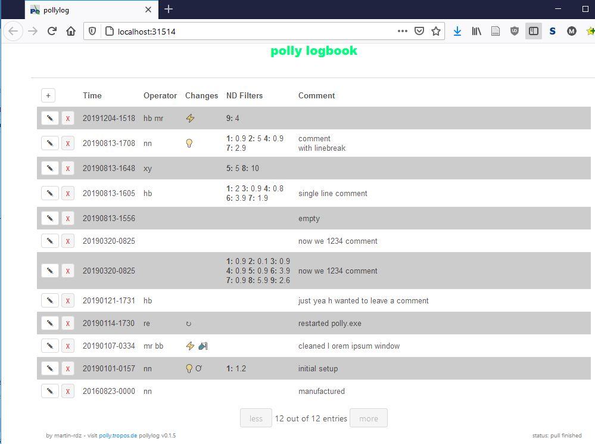

# pollylog

## requirements

For the deployment on polly a java runtime environment version 8 or higher is required.


## Quickstart

On windows run the `start.bat`, the backend will open in cmd shell, and the standard browser will
head to <http://localhost:31514>.
The logbook entries are stored in a fixed format in a csv file.
Adapt the port, filename and channels in the `config.json` file.

Following an update it might be necessary to clear the cache of the local browser.


## Update to new version

1. Get the `pollylog_*.zip` from the releases page.
2. End the running process by closing the terminal window.
3. Place the `start.bat` and the `pollylog-*.jar` into your pollylog folder (the only thing that changes in the `.bat` is the version number).
4. Do **not** change the `config.json`, if the channels, output file or port have not changed. 
5. Run the `start.bat`. The name of the new `.jar` file should show up in the first line in the terminal.
6. Reload the page in the browser, sometimes a hard-refresh (`Ctrl+F5`) is required. The version number is displayed on the bottom left of the page.




## development
The development setup requires leinigen: <https://leiningen.org/>

```
# run backend server
lein run

# and interactive frontend
lein figwheel dev
```	

switch into the dev namespace
```
(in-ns 'pollylogbrowser.core)
```

## build
```
# build the clojurescript frontend
lein clean
lein cljsbuild once min
# pack into .jar file
lein uberjar
# copy the uberjar to to `pollylog_production` and zip
cp .\target\uberjar\pollylog-*-standalone.jar .\pollylog_production\
...
```

## License
Copyright 2025, Martin Radenz, MIT License
